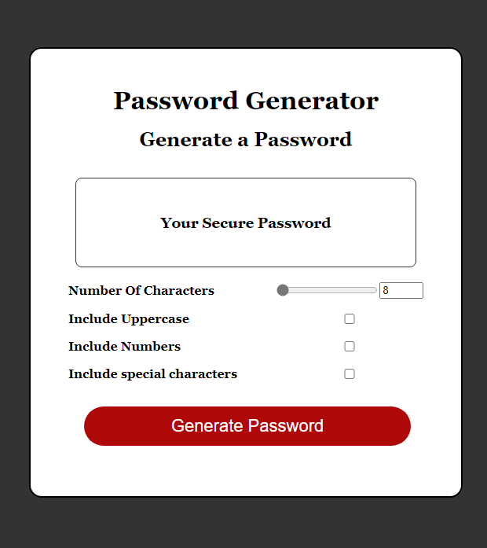

password-generator is a great tool to make secure passwords in a click on of a button.

HOW-TO-USE

simply choose the details you would like to include in your password such as upper case, lower case or special characters, then choose the length of the password and hit the generate password button.

AUTHOR

made by daniel rasi

GIT

here is my github account if you are interested : https://github.com/Dannyb0o0y

